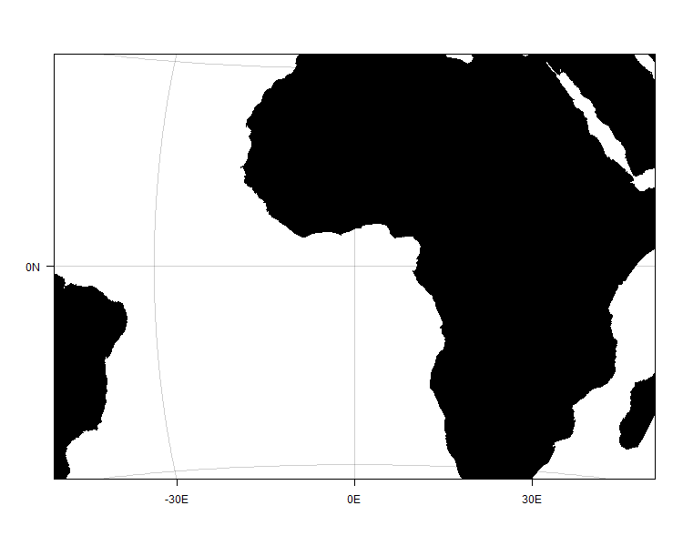
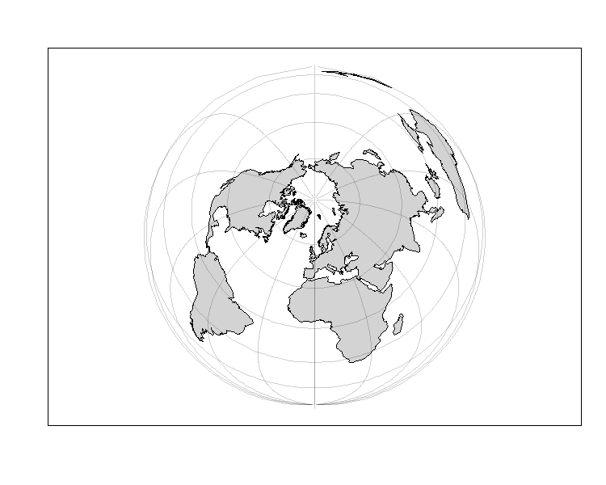
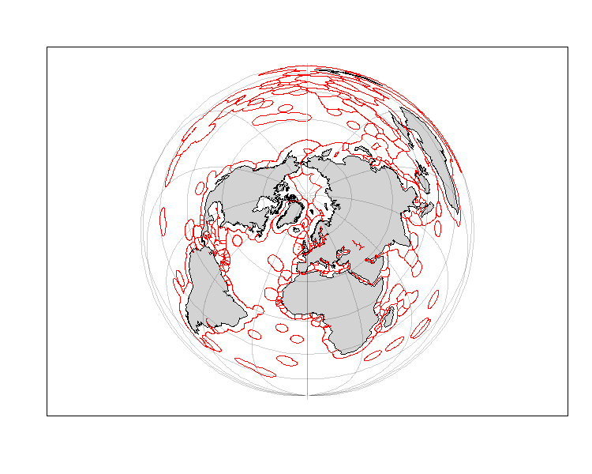
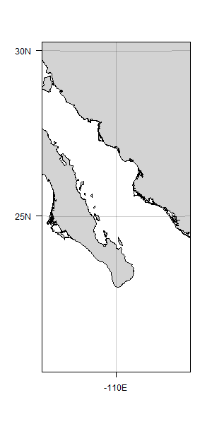
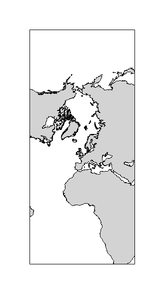
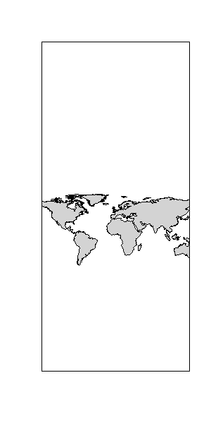

# Simple Mapper
 A Simple mapping library for R. This library is self contained with some optional linkages to other libraries/datasets.

Inspiration for this project originated back in 2017 when we were first exploring options for mapping and visualizing spatial data in the R universe. What we found, and largely still find, was an ecosystem of GIS-centric libraries with far more horse-power than we needed.

Power is great, except when it comes with a learning curve and inflexibility. Finding the then-current libraries were unable to reliably spit out a map of our data points with clear cause-and-effect structures (e.g., do this to add an arrow or do this to add a label), we decided to build our own library suited to the task of making maps simpler.

#### Getting Started

The easiest way to install the pacakge (until I get around to adding this to CRAN) is via _devtools_.

If you don't have _devtools_, then install that first via CRAN:

  install.pacakges('devtools')


Now you can use _devtools_ to install R packages from Github, such as _SimpleMapper_:

  devtools::install_github('tbrycekelly/SimpleMapper')

All done! Now _SimpleMapper_ can be loaded just like any other package: `library(SimpleMpper)`.


#### Examples

__Plain Map__. Here is a basic map with a default center of `longitude = 0`, `latitude = 0`.



```r
map = plotBasemap()
map = addLatitude(map)
map = addLongitude(map)
```

__Plain Map__. You can rescale a map (field of view) to any distance in kilometers. The land color is also specified.



```r
map = plotBasemap(scale = 5e3, land.col = 'black')
map = addLatitude(map)
map = addLongitude(map)
```

__Advanced Map__. This map incldues EEZ boundaries in red.



```r
map = plotBasemap(scale = 20e3, lat = 65.3)
map = addLatitude(map)
map = addLongitude(map)
map = addEEZ(map, col = 'red')
```

__Aspect Ratio__. The aspect ratio of a map is set by the current device canvas size. 



```r
map = plotBasemap(scale = 250, lat = 25.3, lon = -110)
map = addLatitude(map)
map = addLongitude(map)
```

__Sterographic Map__. Any projection _can_ be used with _SimpleMapper_. Included proejections  are `projectionEqualarea` (_default_), `projectionSterographic`, and `proejctionXY`.

<p>


</p>

```r
map = plotBasemap(scale = 6e3, lat = 60, lon = 100, projection = projectionStereographic)
map = addLatitude(map, sides = 2)
map = addLongitude(map)
```

```r
map = plotBasemap(scale = 16e3, lat = 60, lon = 100, projection = projectionXY)
map = addLatitude(map, sides = 2)
map = addLongitude(map)
```

#### Customizable Projections

__SimpleMapper__ is designed from the ground up to be extensible, customizable, and adaptable; so if you would like to apply a custom projection it is as easy as this:

  projectionRotate = function(lon, lat, lon0 = 0, lat0 = 0, inv = F, ...) {
  
    ## Start with= a centered rectangular projection
    lon = lon - lon0
    lat = lat - lat0
    
    ## Apply random rotation
    phi = runif(1, 0, 2*pi)
    lon = cos(phi) * lon - sin(phi) * lat
    lat = cost(phi) * lat + sin(phi) * lon
    
    return(data.frame(longitude = lon,
                      latitude = lat))
  }

This probably isn't a very useful projection, but it certainly works. Here's a few example iterations.

